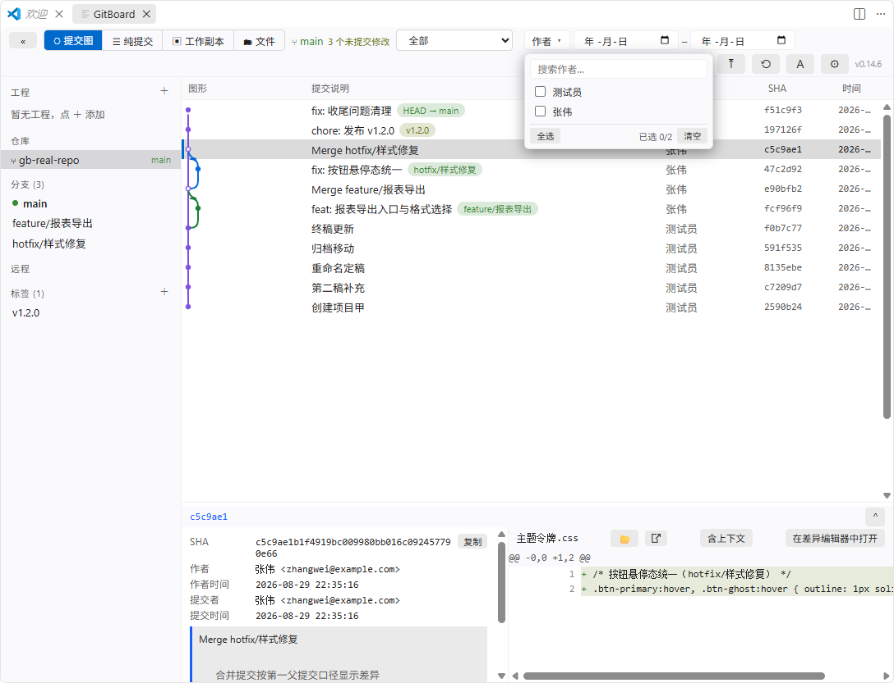
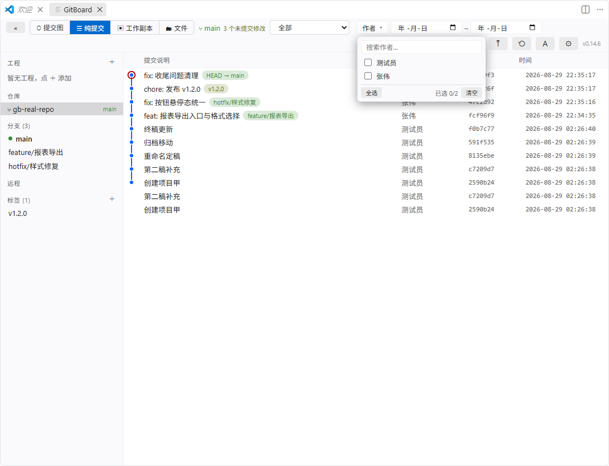
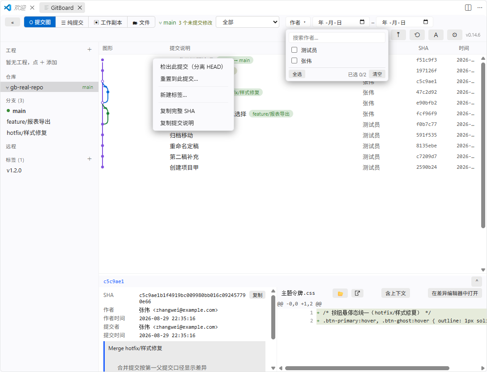
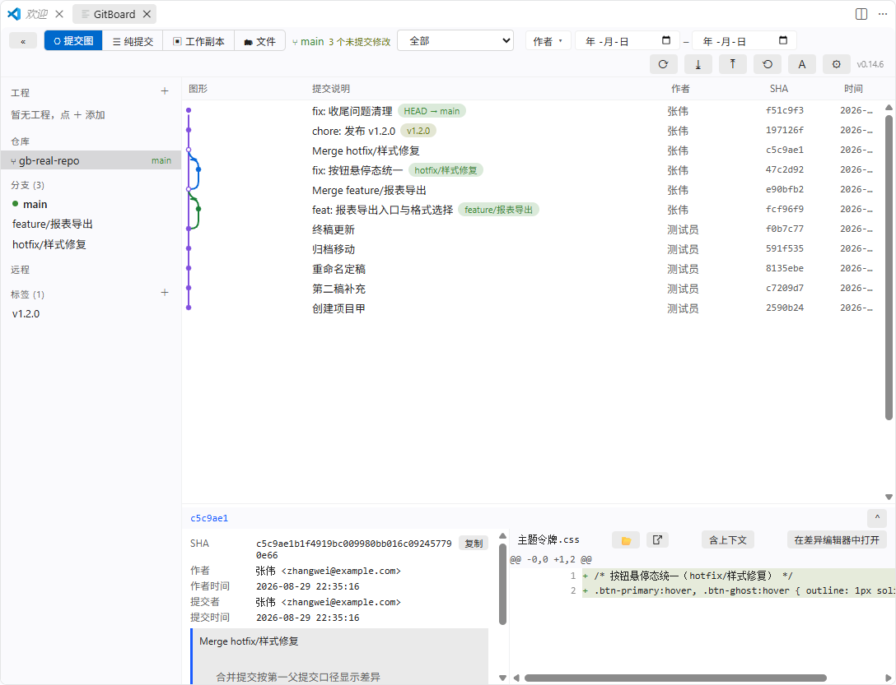
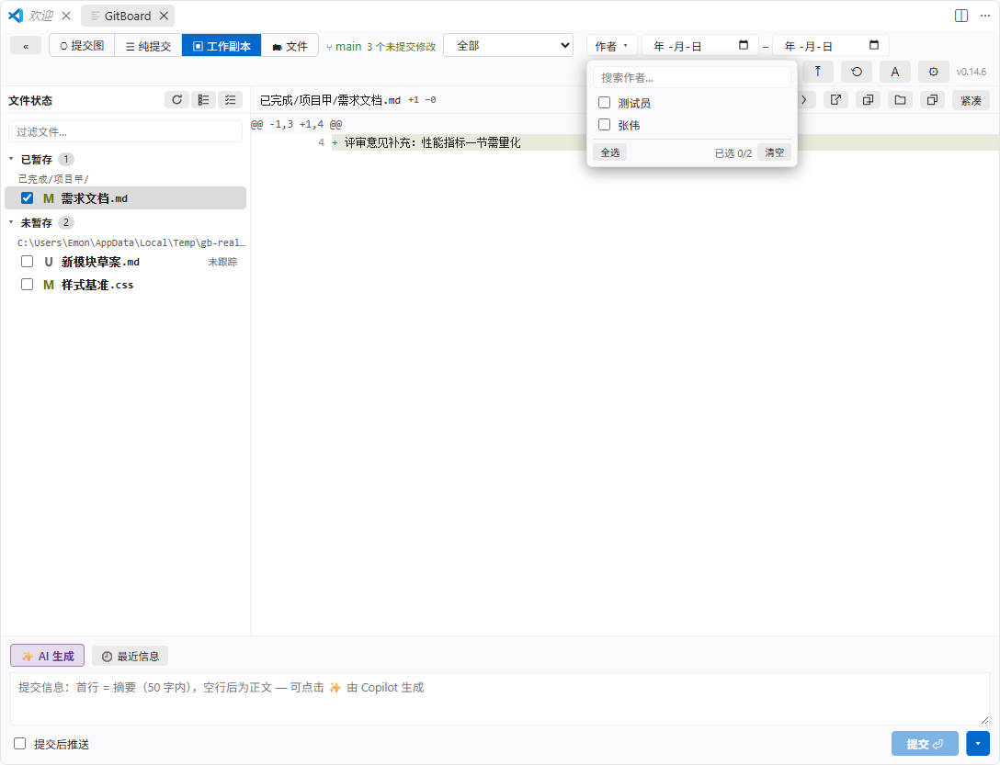
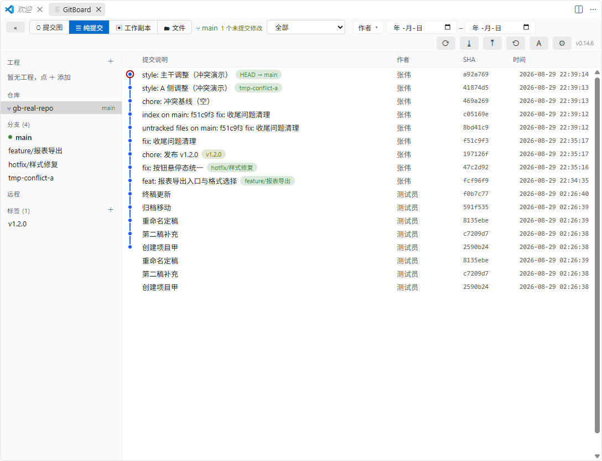
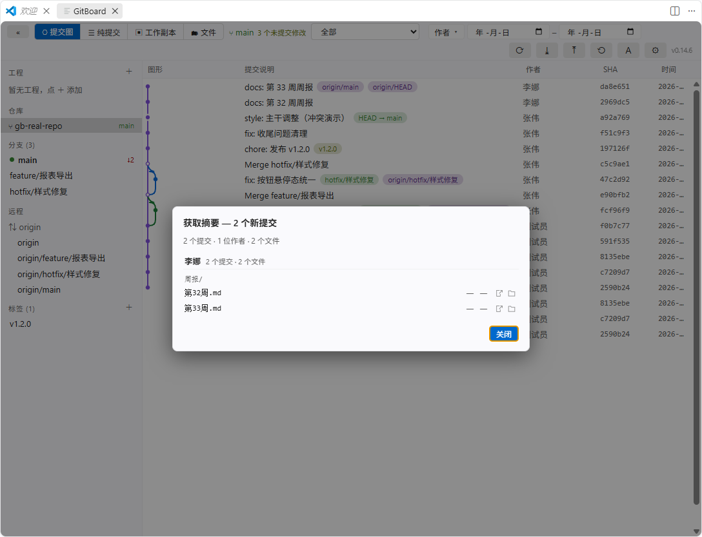
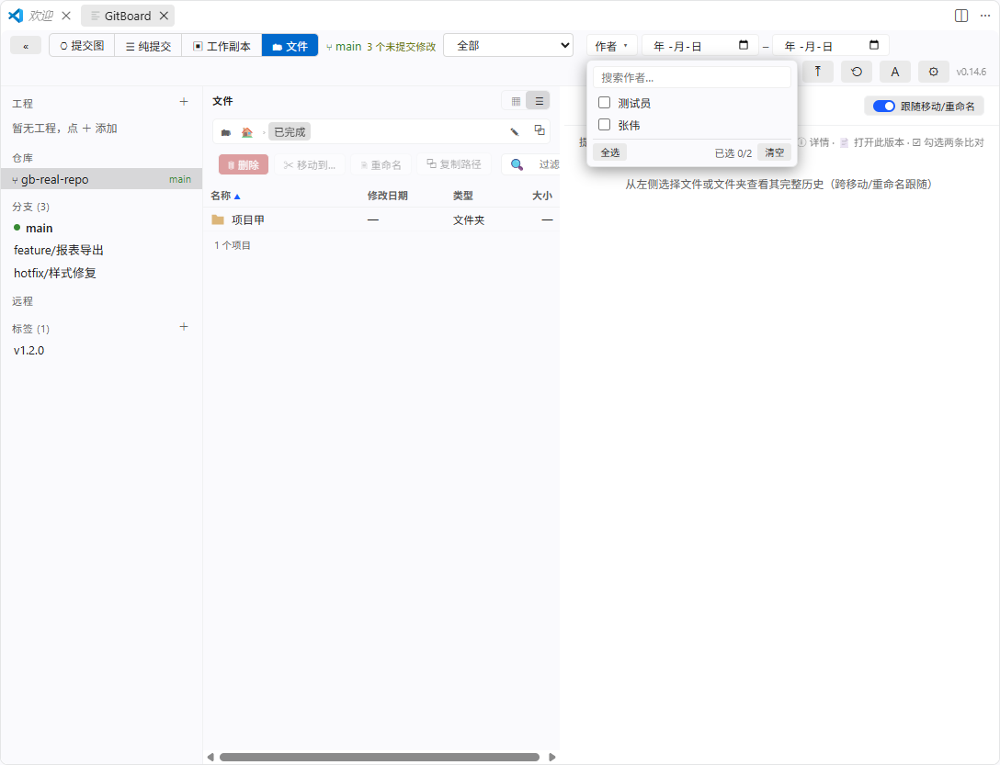

# GitBoard — Git 可视化提交图 / Git Commit Graph for VS Code

**简体中文** | [English](#english-documentation)

> 提交图 · 工作副本提交 · 三栏合并 · 拉取摘要 · 文件历史——日常 Git 操作一站搞定，全程不离开 VS Code。

## 反馈与联系

欢迎提出 **Issue** 与**新需求**，也欢迎反馈使用中遇到的任何问题——每一条反馈都会认真对待：

- 🐛 **问题反馈 / 功能建议**：[GitHub Issues](https://github.com/Emon9426/VSCodeGitGUI/issues)
- 📧 **联系作者**：[emonzhang3438@outlook.com](mailto:emonzhang3438@outlook.com)

> 🐛 Bug reports & feature requests are always welcome at [GitHub Issues](https://github.com/Emon9426/VSCodeGitGUI/issues) · 📧 Contact the author: [emonzhang3438@outlook.com](mailto:emonzhang3438@outlook.com)



---

## 中文文档

### 简介

GitBoard 是一个 VS Code 桌面插件，以**图形化提交历史**为核心，把日常 Git 操作搬进同一个面板：浏览彩色拓扑提交图、查看差异、Fetch / Pull / Push、重置与切换分支，用 SourceTree 式的工作副本视图提交代码（可由 GitHub Copilot 生成提交信息），在三栏合并器里解决冲突，用拉取摘要一眼看清"谁改了什么"，还能在文件历史页里跨移动跟随文件的完整历史。

针对大仓库做了分页加载、虚拟滚动与分层渲染；启动不等待 Git 探测——界面先行渲染，仓库扫描与提交历史后台加载，全程有加载反馈。

**核心特性一览：**

- 🎨 **GitHub 风彩色拓扑提交图**（可切换圆角 / 直角风格），HEAD / 分支 / 远程 / 标签徽标；
- ✅ **SourceTree 式工作副本提交**——勾选即暂存，Copilot AI 一键生成提交信息；
- 🔀 **IDEA / Beyond Compare 式三栏合并冲突解决器**；
- 📥 **Pull / Fetch 变更摘要**——作者 → 目录 → 文件三层分组；
- 📁 **文件历史页**——移动 / 重命名文件夹后历史完整跟随，任意两版本比对；
- ⚡ **大仓库友好**——分页、虚拟滚动、后台自动获取（SourceTree 式）。

### 目录

[功能特性](#功能特性) · [安装](#安装) · [快速上手](#快速上手) · [功能使用详解](#功能使用详解) · [快捷键](#快捷键) · [常用设置](#常用设置) · [从源码开发](#从源码开发) · [常见问题](#常见问题) · [更新日志](#更新日志)

### 功能特性

| 特性 | 说明 |
| --- | --- |
| 图形化提交历史 | 彩色拓扑图呈现分支、合并、交叉与多根仓库；HEAD / 本地分支 / 远程分支 / 标签徽标。**v0.14.6 起默认 GitHub 风格**：细线 + 低饱和配色 + 圆弧转弯，普通提交为实心圆点、合并提交为空心环、HEAD 以背景色粗边强调（不再使用红环）；`gitboard.graphStyle` 可切换 curved（短半径圆角）或 angular（直角折线） |
| 提交详情 | 完整 SHA（一键复制）、作者/提交者、完整提交注释、变更文件列表（状态与 ± 行数，按目录分组、组内只显示文件名）；文件 Ctrl/⌘ 累积多选、Shift 范围多选，文件头 ↗ 按钮或右键一次在编辑器打开多个文件；面板高度按百分比记忆，不同尺寸屏幕相对高度一致；diff 工具栏「在 VS Code 中打开」按钮直接打开工作区文件 |
| 差异对比 | 面板内联 diff（紧凑模式只看增删行，`⋯` 折叠无差异段落）+ VS Code 内置差异编辑器（语法高亮）；合并提交按第一父口径显示 |
| 文件操作 | 打开工作区文件、查看任意历史版本（只读）、在系统文件管理器中定位（已删除文件自动回退父目录）、复制路径；Windows 长路径（>259 字符）自动降级定位到最深可用祖先目录并选中 |
| GUI Git 操作 | Fetch（--all --prune）、Pull（merge/rebase/ff-only）、Push（含设置上游）、重置到提交（soft/mixed/hard，hard 需红色确认）、切换分支、检出远程分支、分离 HEAD；SourceTree 式后台自动获取（默认 10 分钟，可配可关）；操作进度行实时显示 git 明细与耗时、网络操作可取消 |
| 工作副本提交 | 已暂存/未暂存分组，**勾选即暂存、取消即取消暂存**；文件列表按目录分组、文件名过长完整换行；一键移除 `~$` Office 临时文件；单文件 HEAD↔工作副本差异；提交 / 提交并推送 / 修订上次提交 / 暂存全部并提交；最近 8 条信息复用；丢弃（双重确认）；删除文件（转未暂存 D）；行内悬浮按钮（新选项卡打开 / 复制文件名 / 复制路径 / 删除）；文件状态手动刷新按钮；草稿按仓库持久化；提交后推送询问条仅在无其他推送入口时出现 |
| AI 提交信息 | GitHub Copilot 生成：流式填充、可停止/重生成/选模型；学习近 10 条提交的风格与语言；自动遵循 `.copilot/`、`.github/copilot-instructions.md` 等工程指示文件；复用 VS Code 当前登录账号，零凭证。大批量提交加固：统计与差异封顶截断、60s 无响应自动停止；差异不可用时自动降级为文件名 + 目录结构推断，并如实标注 |
| 合并与冲突解决 | IDEA / Beyond Compare 式**三栏合并器**：我的版本 – 合并版本（最终保存的就是它，可编辑）– 他人版本；块级按钮（用我的/用他人/两个都要/都不要）+ 左右栏 «» 一键采纳 + 行内编辑，全程不显示 git 冲突标记，右缘冲突分布导航条；pull/提交遇冲突自动引导横幅；push 被拒引导"拉取并推送"；二进制冲突二选一 + 系统程序预览；一方删除场景；超限文件（>16000 行/2MB）显式警告；随时中止还原现场；全部解决后弹确认完成合并（rebase 语义自动反转）；解决进度落盘，重开无损 |
| Pull/Fetch 摘要 | 每次拉到新提交后弹窗展示**纯净变更摘要**（排除合并等操作提交）：**作者 → 目录 → 文件** 三层分组；文件行带工作区大小与修改时间、行尾按钮一键打开或定位；同作者同文件多提交合并 ×N；重命名显示 `旧名 → 新名`；中文路径无八进制转义；`gitboard.pullFetchSummary` 开关，默认开启 |
| 文件历史页 | 工具栏第四视图「🗂 文件」：左区资源管理器（文件夹视图/详细信息双视图、Win11 式地址栏、多选 + 删除/移动/重命名独立按钮）+ 右区**跨移动/重命名跟随的完整提交历史**（路径链与时期徽标、里程碑行、就地展开详情、只读打开历史版本、勾选任意两版比对）。详见[第 11 节](#11-文件历史页v0140) |
| 筛选 | 分支/远程/标签过滤 + 作者多选下拉 + 时间段（可叠加，条件按仓库记忆） |
| 工程切换 | 左侧栏「工程」区：保存常用工程文件夹（自定义名称），双击当前窗口切换、右键新窗口打开/重命名/移除 |
| 大仓库性能 | 分页加载（500/页，上限可配）、DOM 虚拟滚动 + Canvas 只绘视口、.git 监视防抖自动刷新 |
| 界面 | 跟随 VS Code 明暗主题；**侧栏可折叠**（工具栏 «/»，折叠后 18px 把手一键展开，状态记忆）；列宽拖拽持久化；中英双语；状态栏当前分支；活动栏图标角标显示未提交改动文件数 |

### 安装

**方式〇：扩展市场（发布后可用）**

扩展面板（Ctrl+Shift+X）搜索 **GitBoard** 安装（ID：`EmonZhang3438.gitboard`），或命令行：

```bash
code --install-extension EmonZhang3438.gitboard
```

**方式一：命令行安装 vsix（推荐）**

```bash
code --install-extension gitboard-0.18.4.vsix
```

安装后执行 **Ctrl+Shift+P → “开发者：重新加载窗口”**（每次覆盖安装新版本后都需要；可对照工具栏右侧版本号确认当前构建已生效）。

**方式二：VS Code 界面安装**

扩展面板（Ctrl+Shift+X）→ 右上角 `···` → **“从 VSIX 安装…”** → 选择 `gitboard-0.18.4.vsix` → 重新加载窗口。

**方式三：从源码构建**

```bash
git clone <本仓库> && cd 09_GitGraph
npm install
npm run package     # 产出 gitboard-x.y.z.vsix
```

### 快速上手

1. 打开任意包含 Git 仓库的文件夹/工作区；
2. 点击**左侧活动栏的 GitBoard 图标**（或 `Ctrl+Alt+G`，或命令面板执行 `GitBoard: 打开提交图`）——主界面直接打开；
3. 单击提交行查看详情，双击变更文件打开差异编辑器，右键探索各项操作；
4. 提交代码：点击工具栏 **「▣ 工作副本」**（或 `Ctrl+Alt+C`）→ 勾选要暂存的文件 → 撰写或点 ✨ 由 Copilot 生成提交信息 → `Ctrl+Enter` 提交。

### 功能使用详解

#### 1. 界面布局

对照上方总览图的编号：**①** 工具栏（Fetch/Pull/Push/刷新/设置/版本号 + 筛选控件）；**②** 左侧栏（**工程**、仓库、本地分支含 `↑领先 ↓落后` 徽标、远程、标签）；**③** 提交图（彩色走线、节点、ref 徽标）；**④** 详情概要（SHA、作者、时间、完整注释）；**⑤** 变更文件列表；**⑥** 内联差异。

- 工具栏最左端的分段控件在「**⎔ 提交图 ⇄ ☰ 纯提交 ⇄ ▣ 工作副本 ⇄ 🗂 文件**」四个视图间一键切换，各视图的状态互相保留；
- **侧栏折叠（v0.14.1）**：工具栏最左「«」按钮把工程/仓库/分支/远程面板整体收起，图形与提交列表获得全部宽度；折叠后左缘保留 18px 竖把手（»），点击即恢复；折叠状态跨会话记忆；
- 详情面板高度可拖拽、可折叠（按百分比记忆，不同尺寸屏幕相对高度一致），位置可在设置中改为右侧；
- **☰ 纯提交**：隐藏合并提交，只列常规提交，左侧为窄**圆点时间线**图形列（每行一个圆点，HEAD 加红色圆环），列宽固定。



#### 2. 浏览提交图

- **GitHub 风走线（v0.14.6 默认）**：2px 细线、GitHub 低饱和配色（深浅主题各一套）、换轨为两端四分之一圆弧 + 中段短水平、汇入为圆弧拐入；普通节点实心小圆点，合并节点空心环，HEAD 节点背景色粗边强调。偏好旧观感可在设置切换 `gitboard.graphStyle`：`curved`（短半径圆角 S 曲线，合并外环 + HEAD 红环）或 `angular`（直角折线）；
- 徽标颜色：绿色=本地分支、紫色=远程分支、黄色=标签、`HEAD → main` 表示当前分支；
- 列表滚动到底部自动加载下一页（默认每页 500 条，自动加载上限 20000 条，超出后点“继续加载更多”）；
- `↑` / `↓` 键盘上下移动选中；仓库发生变更（提交/切换分支/fetch）自动防抖刷新；
- **操作进度行**：Fetch/Pull/Push/Refresh 进行时，工具栏下方出现进度条——蓝色填充按 git 进度推进（无百分比阶段为流动动画）、显示 git 明细、实时耗时，网络操作可中途取消；完成绿色闪现后自动收起；
- 窄视口自适应：空间不足时工具栏自动换行、各列按最小宽收缩、列头与内容严格对齐，不再出现元素叠压。

#### 3. 查看提交详情与差异

- **单击提交行**：底部面板显示完整 SHA（点击复制）、作者/提交者与邮箱、作者时间/提交时间（`YYYY-MM-DD HH:mm:ss`，可改为相对时间）、完整提交注释（标题+正文）；
- **单击变更文件**：右侧立即显示内联 diff。默认**紧凑模式**只显示增删行、以 `⋯ 行号 ⋯` 折叠无差异段落；点“含上下文”切换为带 3 行上下文的完整视图；
- **双击文件**（或点“差异编辑器”按钮）：打开 VS Code 内置差异编辑器（父提交版本 ↔ 该提交版本，语法高亮）；diff 工具栏「📂 在 VS Code 中打开」直接打开工作区当前文件；
- **多选批量打开**：文件列表 Ctrl/⌘ 单击累积、Shift 单击范围选择，点文件头 ↗ 按钮（或右键“打开选中的 N 个文件”）一次打开；工作区已不存在的文件自动跳过并提示；
- 合并提交按第一父提交口径显示差异（与 SourceTree 默认一致）。

#### 4. Git 操作



- **Fetch**：工具栏 ⟳，默认 `--all --prune`（可配置）；也可在侧栏远程主机/远程分支上右键按单个远程获取；打开视图时可配置自动 fetch；
- **Pull / Push**：工具栏 ⤓ / ⤒，作用于当前分支的上游配置（`branch.<name>.remote/merge`，与原生 git 语义一致）；Pull 策略可选 merge / rebase / ff-only；Push 无上游时弹窗引导创建；所有网络操作显示实时进度、可取消，且带停滞防护（低速中断 + 无输出超时，见 `gitboard.netStallTimeout`）；
- **重置到某次提交**：提交行右键 →“重置到此提交…”，选择 soft / mixed / hard；工作区有未提交修改且选择 hard 时，必须点击红色确认按钮（防误触）；
- **切换分支**：双击侧栏分支即检出；双击远程分支弹出命名框，创建本地跟踪分支；提交行右键可“检出此提交”（分离 HEAD）；
- **后台自动获取**（SourceTree 式）：面板打开期间按 `gitboard.autoFetchInterval`（默认 10 分钟，0=关闭）静默 fetch，拉到新提交后分支 ↓n 徽标与提交图自动更新，不走进度条、不弹摘要。

#### 5. 筛选



工具栏提供三组可叠加的筛选：**分支下拉**（或单击侧栏分支/远程/标签节点）、**作者多选下拉**（候选自动来自仓库全部作者，支持搜索过滤/全选/清空）、**起止日期选择器**（截止日期含当天全天）。有筛选时显示 × 一键清除；筛选无结果时空态会明确提示。条件按仓库分别记忆。

#### 6. 工程切换（v0.11.0）

左侧栏最上方「**工程**」区，用于在几个常用工程间快速切换 VS Code 工作区：

- **添加**：点分区标题右侧 **＋** → 「保存当前工作区」（多根工作区会逐个列出）或「浏览文件夹…」选择任意目录，输入自定义名称（默认取目录名）；
- **切换**：**双击**工程即在**当前窗口**替换为新工程；右键可选「在新窗口打开」「在当前窗口打开」「重命名…」「移除」「复制路径」；
- 当前工作区命中的工程自动高亮；工程列表持久化保存，重启不丢；路径已被移动/删除时打开会明确报错。

#### 7. 个性化

- **列宽**：图形/提交说明/作者/SHA 四列表头右缘可拖拽调宽（悬停高亮），自动持久化，重装不丢；时间列自适应剩余空间；
- **主题**：全部颜色消费 VS Code 主题变量，明暗自动适配；
- **语言**：默认跟随 VS Code 界面语言，可强制指定；**工具栏「A / 中 / EN」按钮**或命令 `GitBoard: 切换界面语言` 一键切换，**即时生效、无需重载**；
- **按钮反馈**：Fetch / Pull / Push / 刷新点击后按钮进入繁忙态（蓝色脉冲）、完成时短暂闪绿并 toast 说明结果——无新提交也会明确告知（“远程无新提交” / “已是最新的” / “获取完成：N 个分支引用有更新”）。

#### 8. 工作副本与提交



SourceTree 式提交流程，全程不离开 GitBoard：

- **进入**：工具栏「▣ 工作副本」页签（带脏文件数徽标）或 `Ctrl+Alt+C`；活动栏 GitBoard 图标以角标显示未提交改动文件数（多仓库取总和）；
- **暂存**：左栏分「已暂存 / 未暂存」两组，**勾选即 `git add`、取消勾选即取消暂存**（乐观更新）；组内再**按目录分组**——目录头显示完整路径一次（根目录显示仓库绝对路径），组内行只显示文件名；重命名显示 `旧名 → 新名`，未跟踪标 `U`；支持过滤、全部暂存/取消、右键批量操作；
- **刷新文件状态**：在编辑器里修改/保存文件不会触发 `.git` 变化（自动刷新侦听不到），点击文件列表头部的 **⟳ 刷新按钮**立即重新执行 `git status`（图标旋转反馈），角标与徽标随之更新；
- **行内快捷按钮**：文件行悬停时行尾浮现四个图标——**新选项卡打开**（可编辑的真实文件）、**复制文件名**、**复制文件路径**、**删除文件**；右键菜单同步提供；
- **~$ 临时文件清扫**：Word/PPT/Excel 的锁定文件存在时，列表头出现扫帚按钮，一键全部删除；
- **看差异**：点击任一文件行，右栏显示该文件 **HEAD ↔ 工作副本的完整差异**（已暂存+未暂存合并，无页签）；`‹ ›` 在更改文件间逐个切换；未跟踪文件显示为全新增；
- **写提交信息**：单一多行输入框，首行即摘要（计数 50 提示）、空行后为正文；`🕘` 复用最近 8 条提交信息；草稿按仓库自动保存，切视图/重开不丢；
- **提交**：`Ctrl+Enter` 或「提交 ⏎」按钮；下拉可选 **提交并推送 / 修订上次提交**（自动载入上次信息并警示）/ **暂存全部并提交**；hooks 失败会展示完整输出；未直接推送且工作区仍有残留改动时，提交后显示绿色「推送 / 暂不」询问条；
- **AI 生成**：点 **✨** 由 GitHub Copilot 基于已暂存差异生成提交信息——流式填入，可 `Esc` 停止、重新生成、切换模型；语言与风格自动学习近 10 条提交；工程指示文件（`.copilot/*.md`、`.github/copilot-instructions.md`、`.github/instructions/*.instructions.md`）自动遵循；首次使用会请求确认（差异将发送至 Copilot 服务）。大批量提交加固：统计与差异封顶截断、60 秒无响应自动停止、任何失败都解除界面锁定；差异不可用（超大/二进制/超时）时自动降级为文件名 + 目录结构推断并如实标注；
- **丢弃**：右键文件 →「丢弃更改…」，红色双重确认后回到 HEAD（未跟踪文件直接删除）。

#### 9. 合并与冲突解决



pull 或提交产生冲突时，自动切到工作副本视图并弹出引导横幅（**逐个解决 / 全部以我为准 / 全部以他人为准 / 中止合并**）。点击冲突行的「合并…」进入三栏合并器：

- **三栏布局**：左=我的版本、中=合并版本（**最终保存的就是它**，可直接编辑）、右=他人版本；栏头大白话徽标，固定色语义图例常驻；中栏不显示 git 冲突标记，以黄块 + 左缘来源色条（蓝=我的/绿=他人/灰=手动）区分；
- **块级取舍**：每个冲突块头部按钮 **⬅ 用我的 / 两个都要 / 用他人 ➡ / 都不要**；左右栏行内 **« »** 一键把整段采纳进中栏；中栏支持行内编辑与“重选来源”；
- **导航**：右缘冲突分布导航条（minimap）点击跳转；顶部显示文件名与解决进度；
- **特殊场景**：二进制冲突=二选一 + 系统程序预览；一方删除=保留 / 采纳删除（git rm）；超大文件（>16000 行 / 2MB）显式警告并降级为整文件三选一；
- **完成与回退**：全部解决后弹确认条完成合并（merge→创建合并提交 / rebase→继续变基，`--ours/--theirs` 语义自动反转）；随时「中止合并」还原现场；
- **进度落盘**：解决结果防抖写回文件本身，中途关闭/崩溃重开无损。

#### 10. Pull / Fetch 变更摘要



每次 Pull/Fetch 拉到新提交后弹窗展示**纯净变更摘要**（排除 Branch/Merge 等操作提交）——回答"哪些人有哪些提交改了哪些文件"：

- **作者 → 目录 → 文件** 三层分组：作者头（最新提交在前）汇总其提交数/文件数；目录头显示相对路径一次（根目录显示仓库绝对路径）；组内只列文件名（完整不截断，过长换行）；
- 每行带工作区**大小与修改时间**，行尾两个按钮：**打开文件**、**在资源管理器中定位**；
- 同作者同文件多提交合并为一行（×N，悬停列出全部提交与说明）；重命名显示 `旧名 → 新名`；不在工作区的文件显示 `—`；
- 顶部汇总“N 个提交 · M 位作者 · K 个文件”；`gitboard.pullFetchSummary` 设置开关，默认开启；后台自动获取不弹此窗（静默语义）。

#### 11. 文件历史页（v0.14.0）



工具栏第四视图「**🗂 文件**」，移动/重命名文件夹而不丢历史：

**左区·资源管理器**

- **双视图**：「▦ 文件夹视图」平铺网格 / 「☰ 详细信息视图」四列表格（名称/修改日期/类型/大小，**每列可拖宽并记忆**，目录优先，类型彩色图标）；面板宽度可拖拽（280–640px）并记忆；
- **Win11 式地址栏**：面包屑 ⇄ 编辑态（`Ctrl+L` 或点 ✎）；支持仓库**相对路径**（`B/A`）与**绝对路径**——粘贴 `D:\repo\src` 或资源管理器"复制文件地址"的带引号形式均可直达（v0.14.5）；输入文件路径则定位选中并在编辑器打开；路径不存在时红框 + 明确提示；
- **多选与操作**：Ctrl 累积 / Shift 范围选择；命令条独立按钮 **🗑 删除**（git rm，待提交前可恢复）/ **✂ 移动到…** / **🗎 重命名**（F2）/ **⧉ 复制路径** + 过滤框；
- **移动对话框**（v0.14.2）：扩展内目录选择器——面包屑导航 + 子目录懒加载展开，移动到自身子目录时确认按钮禁用（防递归）；取消静默、失败 toast 明确报错；
- 快捷键：`F2` 重命名、`Del` 删除、`Ctrl+L` 编辑地址。

**右区·历史跟随**

- 选中文件/文件夹即显示**跨移动/重命名跟随的完整提交历史**：文件头显示路径链徽标（历代路径分段）；历史列表带**时期徽标**（旧名时期灰标）与**移动/重命名里程碑行**；“跟随移动”可开关（关闭则只看当前路径）；
- 每条提交：**ⓘ 就地展开详情**（不用跳视图）、**📄 只读打开该历史版本**；
- **勾选任意两条 → 比对差异**（blob 级 `git diff sha1:旧路径 sha2:新路径`，跨改名/移动时期依然有效）；
- **移动后引导**：移动/重命名后提示"纯变更单独提交"（混合移动+内容修改会破坏 git 的 R100 重命名识别）；在系统资源管理器手动拖动后，回到 GitBoard 会自动检测并给出同样引导；
- 入口：工具栏「🗂 文件」/ VS Code 资源管理器右键「**查看文件历史**」。

### 快捷键

| 按键 | 功能 |
| --- | --- |
| `Ctrl+Alt+G`（macOS `Cmd+Alt+G`） | 打开提交图 |
| `Ctrl+Alt+C`（macOS `Cmd+Alt+C`） | 打开工作副本（提交）视图并聚焦信息栏 |
| `Ctrl+Enter` | 提交（提交信息框内） |
| `Esc` | 停止 AI 生成 |
| `↑` / `↓` | 移动选中提交 |
| `Enter` | 打开文件所在差异（在详情面板中） |
| `F2` / `Del` / `Ctrl+L` | 文件页：重命名 / 删除 / 编辑地址栏 |

### 常用设置

（`Ctrl+,` 打开设置后搜索 "gitboard"）

| 设置 | 默认 | 说明 |
| --- | --- | --- |
| `gitboard.gitPath` | 自动检测 | git 可执行文件路径 |
| `gitboard.graphStyle` | **github** | 走线风格：**github（GitHub 风细线圆弧转弯、空心合并点）** / curved（短半径圆角）/ angular（直角折线） |
| `gitboard.commitPageSize` | 500 | 每页加载提交数（100–5000） |
| `gitboard.logOrder` | topo | 提交排序：topo（走线规整，默认）/ date（超大仓库更快） |
| `gitboard.maxAutoLoad` | 20000 | 自动加载上限 |
| `gitboard.defaultPullStrategy` | merge | pull 策略：merge / rebase / ff-only |
| `gitboard.dateFormat` | datetime | 时间格式：YYYY-MM-DD HH:mm:ss / 相对时间 / ISO |
| `gitboard.rowHeight` | default | 行高：紧凑 20 / 标准 24 / 舒适 28 |
| `gitboard.detailPanelPosition` | bottom | 详情面板位置：底部 / 右侧 |
| `gitboard.language` | auto | 界面语言（工具栏 A/中/EN 按钮一键切换，即时生效） |
| `gitboard.fetchOnOpen` | true | 打开视图时自动 fetch |
| `gitboard.autoFetchInterval` | 10 | 后台自动获取间隔（分钟，0=关闭）：静默 fetch 全部远程，拉到新提交自动更新徽标与提交图 |
| `gitboard.netStallTimeout` | 180 | 网络操作（Fetch/Pull/Push）无输出空闲超时（秒，0=关闭）：连接停滞自动中断并提示重试，防无限挂起 |
| `gitboard.pullFetchSummary` | true | Pull/Fetch 拉到新提交后弹窗显示纯净提交摘要 |
| `gitboard.revealSelectStyle` | classic | 「在资源管理器中显示」的 explorer 传参形态（explorer 对 `/select` 的解析随 Windows 版本而异）：classic = 无引号原样单参数（各版本通用）；separate / quoted 为异构环境兜底 |
| `gitboard.startView` | graph | 打开时的初始视图：提交图 / 工作副本 / 上次使用 |
| `gitboard.ai.enabled` | true | 启用 Copilot 生成提交信息（不可用时自动隐藏入口） |
| `gitboard.ai.modelFamily` | 默认模型 | 首选 Copilot 模型 family |
| `gitboard.ai.language` | auto | 生成语言（auto = 跟随近期提交） |
| `gitboard.ai.learnFromHistory` | true | 学习近 10 条提交的风格与语言 |
| `gitboard.ai.useWorkspaceInstructions` | true | 遵循工程指示文件（`.copilot/`、`.github/`） |
| `gitboard.commit.clearMessage` | true | 提交成功后清空信息框 |
| `gitboard.commit.pushAfter` | false | 「提交后推送」复选框默认值 |

### 从源码开发

```bash
npm install
npm run watch       # F5 调试（“运行 GitBoard 扩展”）
npm run typecheck   # 双工程类型检查
npm test            # 单元测试 + 真实 git 冒烟（GITGRAPH_SMOKE=1 启用）
npm run build && npm run package
```

### 常见问题

- **安装新版本后行为没变化？** 务必执行“开发者：重新加载窗口”；可对照工具栏右侧版本号确认当前构建。
- **活动栏里找不到 GitBoard 图标？** 若工作区处于**受限模式**（不受信任），VS Code 会禁用本扩展——在“管理工作区信任”中将文件夹设为受信任即可。
- **「在资源管理器中显示」没反应或打开了错误目录？** 少数 Windows 构建上 explorer 对 `/select` 参数的解析不同——在设置中把 `gitboard.revealSelectStyle` 依次换成 `separate`、`quoted` 试试（即时生效，无需重载）；都不行请带上 Windows 版本（winver）到 [Issues](https://github.com/Emon9426/VSCodeGitGUI/issues) 反馈。
- **支持 vscode.dev / github.dev 吗？** 不支持，插件需要在本机执行 git 命令。
- **超大仓库卡吗？** 分页 + 虚拟滚动保证流畅；可运行 `git commit-graph write --reachable` 进一步加速翻页。
- **✨ AI 生成按钮没出现？** 需要 VS Code ≥ 1.99 且已登录 GitHub Copilot（与 Copilot Chat 同一账号）；未登录或不可用时按钮自动隐藏，其余提交功能不受影响。也可检查 `gitboard.ai.enabled` 是否开启。
- **AI 会发送什么内容？** 已暂存差异（暂存为空时为全部更改）与工程指示文件内容，经 GitHub Copilot 服务处理（使用你当前登录的账号与配额）；首次使用会弹窗确认，超限文件只发送统计不发送内容。
- **一次性提交很多代码时 AI 会卡死吗？** 不会：文件统计与差异均封顶截断，prompt 始终在模型上下文内；Copilot 60 秒无响应会自动停止并提示重试/换模型；即使 git 读取差异失败也会立即报错并解锁界面。
- **移动文件夹后历史会丢吗？** 不会。文件页的历史查询基于 `git log --follow` + 目录边界反查，跨移动/重命名完整跟随；唯一要求是**纯移动单独成提交**（移动的同时大改内容会破坏 git 的重命名识别），扩展会在你移动后主动提醒。
- **图形列想换回旧样式？** 设置 `gitboard.graphStyle` 为 `curved`（短半径圆角）或 `angular`（直角折线）即可。

### 更新日志

**v0.19.2**（2026-09-05）：修复「拉取记录不完整」——Pull 稳定性与网络防护四项加固（[#6](https://github.com/Emon9426/VSCodeGitGUI/issues/6)）——①Pull 改为按分支级配置（`branch.<name>.remote/merge`）拉取：此前显式传"本地分支名"当远端分支参数，本地名 ≠ 上游名时（如默认分支改名后 `branch -u origin/main master`）会去拉同名的远端旧分支，git 报 "Already up to date." 假成功而对方新提交永远拉不进来；②Fetch/Pull/Push 增加网络停滞防护：git 层低速中断（持续 <1KB/s 60 秒）+ 无输出空闲看门狗（`gitboard.netStallTimeout`，默认 180 秒，0=关闭），连接停滞自动中断并提示重试，不再无限挂起占用操作队列（看门狗同时覆盖 SSH 等非 HTTP 远端）；③Pull"已是最新"反馈带上游分支名（如 "origin/main 已是最新"），拉错分支/远端一眼可见，并新增"上游领先却未合并任何提交"的矛盾告警；④慢网络下连点 Fetch/Pull/Push 只执行一个（同类操作去重），排队期间被取消的操作不再执行。

**v0.19.1**（2026-09-04）：修复筛选功能三缺陷（[#5](https://github.com/Emon9426/VSCodeGitGUI/issues/5)）——①按作者筛选无效：含 `[]`、逗号等字符的作者名（如 `dependabot[bot]`）曾因字符白名单被静默丢弃导致筛选不生效，现放宽校验并按 git 基本正则转义后精确匹配；②按日期筛选错位：git 的 `--since/--until` 按提交者日期过滤而列表显示作者日期，rebase/cherry-pick 过的仓库两边对不上，现改为按作者日期（与显示同口径）在扩展侧过滤，分页改为扫描游标续扫；③新增：选择起始日期时自动带入截止日期 = 起始日期。

**v0.19.0**（2026-09-03）：**「快速笔记」整体迁移为独立插件 QuickNotes**——GitBoard 回归纯 Git 工具，安装包随之移除 TipTap 等前端依赖、更轻量。笔记数据与默认目录（`~/GitBoardNotes`）保持不变，导出的 HTML 仍可往返编辑；`Ctrl+Alt+N` 快捷键与活动栏入口随功能移至新插件。

**v0.18.x**

- **v0.18.4**（2026-09-02）：文档——README 全面重排版（新增 Issue 反馈入口与作者联系方式、版本历史独立为更新日志、补充快速笔记详解与 reveal 排查 FAQ）。
- **v0.18.3**（2026-09-02）：「在资源管理器中显示」在部分 Windows 构建上依旧无效（explorer 对 `/select` 的解析随版本漂移）——改用无引号原样单参数的经典形态（自 XP 起各版本通用），新增 `gitboard.revealSelectStyle` 设置供异构环境一键切换兜底。
- **v0.18.2**（2026-09-01）：修复长路径与含空格路径下「在资源管理器中显示」失效（含空格曾直接打开文档目录、>259 路径在严格 MAX_PATH 系统上曾误报"文件已不存在"）——增加 `\\?\` 前缀存在性探测与"最深可定位祖先目录"降级；快速笔记同步加固，文件缺失时明确提示。
- **v0.18.1**（2026-09-01）：修复合并冲突"我的/他人的"二选一选侧反转（merge 与 rebase 均已修正）与二进制冲突预览打开错误一侧；工作副本文件列表宽度可自由拉宽并跨会话记忆；文件页"移动到"可连续使用且对话框初始定位到文件所在目录；后台自动获取增加低速中断保护。
- **v0.18.0**（2026-08-30）：笔记编辑深化——代码块实时语法高亮 + 独立行号 + 语言标签（纯文本自动识别）、信息块标题可直接输入、画板连线默认正交折线、Delete 只删选中图形、所有非正文元素带删除按钮、行号支持表格按行计数并在图片加载后自动对位。

**v0.17.0**（2026-08-30）：笔记体验升级——文档标题头（旧笔记首行 H1 自动迁移）、正文插图（粘贴/拖放/选图 + 四角拖拽调宽）、行号显示、AI 浮层可拖动并记忆位置、`/` 菜单与 AI 菜单空白点击或 ESC 关闭、删除笔记确认框居中可见、画板图形密度对齐正文行高、工具栏图标全部矢量 SVG。

**v0.15.0**（2026-08-30）：新增「快速笔记」——三栏布局富文本笔记（表格/卡片/代码块/SVG 画板/`/` 菜单），Copilot AI 编辑（续写/润色/翻译/摘要/待办化 + 差异预览），存储于工程外目录、完全独立于 Git，导出 Markdown / 自包含 HTML / PDF。

**v0.14.x**

- **v0.14.7**（2026-08-30）：启动不再等待 Git 探测——工具栏/工程列表/布局记忆先行渲染，仓库扫描后台加载，无仓库时立即显示引导。
- **v0.14.6**（2026-08-29）：图形列默认 GitHub 风格（细线低饱和配色 + 圆弧转弯 + 空心合并点）。
- **v0.14.0**（2026-08-29）：文件历史页——跨移动/重命名跟随完整历史、路径链与时期徽标、任意两版本比对、Win11 式地址栏。

---

## English Documentation

**[简体中文](#中文文档)** | **English**

> Commit graph · working-copy commits · 3-way merge · pull summaries · file history · quick notes — everyday Git in one panel, without leaving VS Code.

## Feedback & Contact

Bug reports and feature requests are always welcome — every piece of feedback counts:

- 🐛 **Issues & feature requests**: [GitHub Issues](https://github.com/Emon9426/VSCodeGitGUI/issues)
- 📧 **Contact the author**: [emonzhang3438@outlook.com](mailto:emonzhang3438@outlook.com)


### Introduction

GitBoard is a VS Code (desktop) extension that puts a **graphical commit history** at the center and gathers everyday Git operations into one panel: browse a colored topology graph, inspect diffs, Fetch / Pull / Push, reset and checkout, commit SourceTree-style with **AI commit messages via GitHub Copilot**, resolve conflicts in a 3-way merge editor, see "who changed what" in pull summaries, and follow file history across moves and renames.

Large repos are handled with paged loading, virtualized scrolling and layered rendering; startup never waits for Git probing — the shell renders first, scanning loads in the background.

**Highlights:**

- 🎨 **GitHub-style colored topology graph** (curved / angular styles available);
- ✅ **SourceTree-style working-copy commits** with Copilot-generated messages;
- 🔀 **IDEA / Beyond Compare style 3-way merge resolver**;
- 📥 **Pull/fetch summaries** grouped author → directory → file;
- 📁 **File history page** that follows moves & renames, with any-two-version compare;
- ⚡ **Large-repo friendly** — paging, virtualization, background auto-fetch.

### Features

| Feature | Description |
| --- | --- |
| Commit graph | Colored topology with branches, merges, criss-cross and multi-root repos; HEAD / branch / remote / tag chips. **GitHub style is the default since v0.14.6**: thin lines, low-saturation palette, arc turns; solid dots for commits, hollow rings for merges, HEAD emphasized with a thick background-colored border. Switch back via `gitboard.graphStyle`: `curved` (short-radius corners) or `angular` (right angles) |
| Commit details | Full SHA (one-click copy), author/committer, full message, changed files with status and ± counts grouped by directory (filename-only rows); Ctrl/⌘ multi-select and Shift range-select, open them all at once; panel height remembered as a percentage; "open in VS Code" button on the diff toolbar |
| Diffs | Inline diff (compact mode shows changed lines only, `⋯` folds unchanged runs) + the built-in diff editor with syntax highlighting; merges diffed against their first parent |
| File actions | Open working file, open any revision read-only, reveal in the system file manager (falls back to the parent folder for deleted files), copy path; long Windows paths (>259 chars) automatically degrade to the deepest revealable ancestor folder |
| Git operations | Fetch (--all --prune), Pull (merge/rebase/ff-only), Push (with upstream setup), Reset to commit (soft/mixed/hard — hard needs a red confirmation), checkout branches, checkout remote branch as local tracking, detached HEAD; SourceTree-style background auto-fetch (10 min by default, configurable); a progress bar under the toolbar shows git detail, elapsed time, and a cancel button for network ops |
| Working-copy commits | Staged/Unstaged groups, **check a box to `git add` / uncheck to unstage**; files grouped by directory, long filenames wrap; one-click `~$` Office lock-file cleanup; single-file HEAD↔worktree diff; Commit / Commit & Push / Amend / Stage-all-and-commit; recent-message reuse; discard with double confirmation; delete files (tracked files move to Unstaged as D); hover quick actions (open in new tab / copy name / copy path / delete); on-demand status refresh button; per-repo drafts; the post-commit "push?" ask-bar appears only when no other push affordance exists |
| AI commit messages | One-click generation via GitHub Copilot: streamed inline, stop/regenerate/model picker; style learned from the last 10 commits; automatically follows `.copilot/` and `.github/` instruction files; uses your signed-in account — zero credentials. Hardened for huge changesets: capped summary & diff, 60s watchdog, UI always unlocks; falls back to file-name/folder-structure inference when the diff is unusable, honestly noted |
| Merge & conflict resolution | IDEA / Beyond Compare style **3-way merge editor**: Mine – Merged (what gets saved, editable) – Theirs; per-chunk buttons (use mine / theirs / keep both / neither) + «» adopt arrows + inline editing, git conflict markers never shown, conflict minimap; pull/commit conflicts open a guidance banner; rejected pushes guide you to pull-and-push; binary = pick-one-side + system preview; deleted-side scenarios; oversized files get an explicit warning and reduce to whole-file choices; abort anytime; a confirmation finishes the merge (rebase semantics flipped automatically); progress is saved to the file itself — reopening is lossless |
| Pull/Fetch summary | After every pull/fetch that brings new commits, a popup lists the **pure changes** (merge ops excluded) grouped **author → directory → file**: filename rows (never truncated) with working-tree size & mtime, inline open/reveal buttons, same-file commits merged into ×N rows, renames as `old → new`; toggle with `gitboard.pullFetchSummary`, on by default |
| File history page | Fourth view "🗂 Files": an explorer (tiles/details views, Win11-style address bar, multi-select with Delete / Move to… / Rename buttons) + a right panel with the **full history following moves/renames** (path chain, era badges, milestone rows, inline details, read-only revisions, any-two-version compare) |
| Filtering | Branch/remote/tag filter + multi-select author dropdown + date range, stackable and remembered per repository |
| Projects | "Projects" section in the sidebar: save favorite workspace folders with custom names; double-click to switch the current window, right-click for new window / rename / remove |
| Large-repo performance | Paged loading (500/page, configurable cap), virtualized rows + viewport-only canvas rendering, debounced auto-refresh on `.git` changes |
| UI | Follows VS Code light/dark themes; **collapsible sidebar** («/» toggle, 18px edge handle to restore, remembered); drag-resizable persisted columns; English/中文; status-bar branch; activity-bar icon badge with the uncommitted-change count |

### Install

**Option 0 — Marketplace (once published)**

Search **GitBoard** in the Extensions view (Ctrl+Shift+X), ID: `EmonZhang3438.gitboard`, or:

```bash
code --install-extension EmonZhang3438.gitboard
```

**Option 1 — CLI (recommended)**

```bash
code --install-extension gitboard-0.18.4.vsix
```

Then run **Ctrl+Shift+P → “Developer: Reload Window”** (required after every upgrade; check the version label on the toolbar).

**Option 2 — From the UI**

Extensions view (Ctrl+Shift+X) → `···` → **“Install from VSIX…”** → pick the file → reload.

**Option 3 — From source**

```bash
npm install && npm run package
```

### Quick Start

1. Open a folder/workspace containing Git repositories;
2. Click the **GitBoard icon in the Activity Bar** (or press `Ctrl+Alt+G`, or run `GitBoard: Open Commit Graph`);
3. Click a commit row for details, double-click a file to open the diff editor, right-click everywhere for more actions;
4. To commit: switch to the **“▣ Working Copy”** tab (or `Ctrl+Alt+C`) → check the files to stage → write the message or click ✨ to generate it with Copilot → `Ctrl+Enter` to commit.

### Using the Features

**1. Layout** — see the numbered badges in the overview: ① toolbar & filters, ② branch/remote/tag tree, ③ commit graph, ④ commit summary, ⑤ changed files, ⑥ inline diff. The segmented control on the far left switches between **Graph / Pure / Working Copy / Files**; state is preserved across switches. The **«** button collapses the projects/repo/branch sidebar for a full-width graph (an 18px edge handle restores it; the state is remembered). The detail panel is drag-resizable (remembered as a percentage) and can be moved to the right side in settings. The **Pure** view lists regular commits only (merges hidden) with a slim dot-timeline column — one dot per commit, HEAD marked with a red ring.


**2. Browsing** — **GitHub style (default since v0.14.6)**: 2px thin lines, a low-saturation palette (separate sets for light/dark themes), quarter-arc lane changes with a short horizontal middle, arc-style merge elbows; solid dots for commits, hollow rings for merges, HEAD emphasized with a thick background-colored border. Prefer the old look? Set `gitboard.graphStyle` to `curved` (short-radius S curves, merge outer rings, HEAD red ring) or `angular` (right angles). Chips: green = local branch, purple = remote, yellow = tag, `HEAD → main` = current branch. Scrolling near the bottom auto-loads the next page (500/page by default; auto-load caps at 20,000). `↑`/`↓` move the selection. A progress bar under the toolbar tracks network operations with git detail, elapsed time and a cancel button. Narrow viewports degrade gracefully — the toolbar wraps and columns shrink without overlap.

**3. Details & diffs** — click a row for the full SHA (click to copy), author/committer, dates and the complete message. Click a file to preview its diff inline — compact mode highlights only added/removed lines and folds unchanged runs into `⋯` rows; switch to "with context" for full context. Double-click a file (or use the header button) to open VS Code's built-in diff editor. Ctrl/⌘-click toggles files into a selection, Shift-click selects a range; the ↗ button opens all selected files at once (missing files are skipped with a notice). Merges are diffed against their first parent.

**4. Operations**


① commit-row context menu (detached checkout, reset, copy SHA/subject); ② file context menu (open working file, read-only revision, reveal in file manager, copy path); ③ branch menu (double-click a branch to check it out; double-click a remote branch to create a local tracking branch); ④ the reset dialog — hard resets require an explicit red confirmation when uncommitted changes exist. **Fetch** (⟳) defaults to `--all --prune`; per-remote fetch from the sidebar context menu. **Pull/Push** act on the current branch's configured upstream (`branch.<name>.remote/merge`); a push without upstream offers to create one. Background **auto-fetch** (SourceTree-style) runs silently every 10 minutes by default (`gitboard.autoFetchInterval`, 0 = off) and updates badges/graph without popups.

**5. Filtering**


Three stackable filters: the **branch dropdown** (or click a sidebar node), a **multi-select author dropdown** (candidates auto-collected from the repo, with search/select-all/clear), and a **date range** (the end date includes the whole day). An × clears everything at once; filters are remembered per repository.

**6. Projects** — the **Projects** section at the top of the sidebar stores favorite workspace folders: click **＋** to save the current workspace or browse any folder (custom names); double-click a project to replace the current window, or right-click for *new window / rename / remove / copy path*. The matching project is highlighted; the list persists across sessions.

**7. Personalization** — drag column borders to resize (persisted); colors follow your theme; the UI language switches instantly via the **A / 中 / EN** toolbar button (no reload). Fetch/Pull/Push/Refresh buttons pulse while running and flash green on completion with explicit toasts ("remote has nothing new" / "already up to date" / "N branch refs updated").

**8. Working copy & commits**


Switch via the "▣ Working Copy" tab (dirty-file badge) or `Ctrl+Alt+C`. The left pane groups **Staged / Unstaged** files — **check to `git add`, uncheck to unstage** — with directory grouping, `old → new` renames and `U` untracked marks. Hovering a row reveals quick actions: **open in a new tab** (editable), **copy name**, **copy path**, **delete**; a **⟳ refresh** button re-runs `git status` on demand (editor edits never touch `.git`); a broom button removes `~$` Office lock files when present. Clicking a file shows its full **HEAD↔worktree diff** with `‹ ›` to walk files. The bottom bar has a single message box (first line = subject, 50-char counter), a 🕘 recent picker, and **Commit ⏎** with a dropdown (Commit & Push / Amend / Stage-all-and-commit); drafts are saved per repo. **✨ AI** generates the message from the staged diff via Copilot — streamed inline, `Esc` to stop, model picker included; workspace instruction files are followed automatically. Discard resets to HEAD behind a red double confirmation.

**9. Merge conflicts**


Pull/commit conflicts auto-switch to the working-copy view with a guidance banner (*resolve one by one / all mine / all theirs / abort*). Click "Merge…" on a conflict row to open the 3-way editor: **Mine | Merged (what gets saved — editable) | Theirs**, with plain-language column badges and a fixed color legend. Per-chunk buttons (**⬅ use mine / keep both / use theirs ➡ / keep neither**), «» adopt arrows on side panes, inline editing in the middle column, and a conflict-distribution minimap on the right edge. Git conflict markers are never shown — blocks carry source-colored bars instead (blue = mine, green = theirs, gray = manual). Binary conflicts reduce to pick-one-side with a system-preview button; deleted-side scenarios offer keep / accept-deletion; oversized files (>16000 lines / 2MB) warn and reduce to whole-file choices. Abort restores the pre-merge state at any time; once everything is resolved, a confirmation bar finishes the merge (merge commit, or continue the rebase with flipped ours/theirs semantics). Resolution progress is flushed to the file itself — reopen anytime, nothing is lost.

**10. Pull/Fetch summary**


Every pull/fetch that brings new commits pops a **pure-change summary** (branch/merge ops excluded) answering "who landed which commits touching which files": grouped **author → directory → file**; filename-only rows (never truncated) with working-tree size & mtime and inline **open / reveal** buttons; the same file touched several times merges into one ×N row (hover lists every commit); renames show `old → new`. Toggle with `gitboard.pullFetchSummary` (on by default); background auto-fetch stays silent.

**11. File history page (v0.14.0)**


The fourth view "🗂 Files" lets you move/rename folders without losing history:

- **Explorer on the left**: tiles or details view (name/date/type/size — every column resizable and remembered, folders first, colored type icons); drag-resizable pane width (280–640px, remembered);
- **Win11-style address bar**: breadcrumbs ⇄ edit mode (`Ctrl+L`); accepts **relative paths** (`B/A`) as well as **absolute paths** — paste `D:\repo\src` or the quoted "copy file address" form from Explorer and it just works (v0.14.5); a file path locates and opens it; invalid paths get a red border with an explicit message;
- **Multi-select & actions**: Ctrl/Shift selection; dedicated **Delete** (git rm, recoverable until committed) / **Move to…** / **Rename** (F2) / **Copy path** buttons plus a filter box;
- **Move dialog** (v0.14.2): an in-extension folder picker — breadcrumb navigation with lazy child loading; moving into a descendant disables Confirm (no recursion); cancellations stay silent, failures toast clearly;
- **History on the right**: selecting a file/folder shows the **full history following moves and renames** — a path-chain badge (one segment per era), era badges for old-name periods, milestone rows for each move/rename, and a "follow moves" toggle. Every commit can be **expanded inline** or **opened read-only**; **check any two commits to compare** (blob-level diff, valid across rename eras);
- **Move guidance**: after a move/rename you are nudged to commit it alone (mixing moves with content changes breaks git's R100 rename detection); manual moves made in the system explorer are detected on return with the same nudge;
- Entry points: the "🗂 Files" toolbar tab, or right-click a file in the VS Code explorer → **"Show File History"**.

### Keybindings

| Key | Action |
| --- | --- |
| `Ctrl+Alt+G` / `Cmd+Alt+G` | Open the commit graph |
| `Ctrl+Alt+C` / `Cmd+Alt+C` | Open the Working Copy view |
| `Ctrl+Enter` | Commit (inside the message box) |
| `Esc` | Stop AI generation |
| `↑` / `↓` | Move selection |
| `F2` / `Del` / `Ctrl+L` | Files view: rename / delete / edit address bar |

### Settings

Search "gitboard" in Settings: `graphStyle` (**github** default / curved / angular), `commitPageSize`, `logOrder`, `maxAutoLoad`, `defaultPullStrategy`, `dateFormat`, `rowHeight`, `detailPanelPosition`, `language`, `fetchOnOpen`, `autoFetchInterval`, `netStallTimeout`, `pullFetchSummary`, `revealSelectStyle` (**classic** default — switch to separate/quoted if "Reveal in file manager" misbehaves on your Windows build), `startView`, `ai.enabled` / `ai.modelFamily` / `ai.language` / `ai.learnFromHistory` / `ai.useWorkspaceInstructions`, `commit.clearMessage` / `commit.pushAfter`, plus `gitPath` for a custom git binary.

### FAQ

- **Nothing changed after upgrading?** Run "Developer: Reload Window"; the version label on the toolbar tells you which build is live.
- **No GitBoard icon in the Activity Bar?** If the workspace is in **restricted (untrusted) mode**, VS Code disables the extension — trust the folder via "Manage Workspace Trust".
- **"Reveal in file manager" does nothing or opens the wrong folder?** Explorer's `/select` parsing varies across Windows builds — try switching `gitboard.revealSelectStyle` to `separate` and then `quoted` (effective immediately, no reload); if none work, please report with your Windows version (winver) on [Issues](https://github.com/Emon9426/VSCodeGitGUI/issues).
- **vscode.dev?** Not supported — the extension runs your local `git`.
- **Huge repos?** Paging + virtualization keep it smooth; `git commit-graph write --reachable` speeds up paging further.
- **No ✨ AI button?** Needs VS Code ≥ 1.99 and an active Copilot sign-in; the button hides itself when unavailable. Check `gitboard.ai.enabled`.
- **What does AI send?** The staged diff (or all changes when nothing is staged) plus workspace instruction files, under your signed-in account and quota; a one-time confirmation appears first; oversized files are reduced to stats only.
- **Does AI hang on huge changesets?** No: summary and diff are capped, a 60s watchdog stops stalled requests, and any failure unlocks the UI immediately.
- **Does history survive folder moves?** Yes — the file page uses `git log --follow` plus directory-boundary reverse lookup, so history follows moves/renames completely. The one rule: **commit pure moves separately** (mixing a move with content changes breaks git's rename detection); GitBoard nudges you right after a move.
- **Want the old graph look?** Set `gitboard.graphStyle` to `curved` or `angular`.

### Changelog

- **v0.19.2** (2026-09-05): fixed "pull brings no commits / needs several retries" — four pull-stability hardenings ([#6](https://github.com/Emon9426/VSCodeGitGUI/issues/6)) — ① Pull now resolves the remote/branch from the branch config (`branch.<name>.remote/merge`, native git semantics): it previously passed the *local* branch name as the remote-side argument, so when local and upstream names differ (e.g. `branch -u origin/main master` after a default-branch rename) it fetched a stale same-named remote branch and git reported "Already up to date." with exit 0 while the peer's new commits never arrived; ② Fetch/Pull/Push gained stall protection: a git-level low-speed cutoff (<1KB/s for 60s) plus a no-output watchdog (`gitboard.netStallTimeout`, default 180s, 0 = off) that also covers SSH remotes — stalled connections fail fast with a retry hint instead of hanging the serial op queue forever; ③ the "already up to date" notice now names the upstream (e.g. "origin/main is already up to date") so a wrong branch/remote is immediately visible, plus a contradiction warning when the upstream is ahead yet nothing was merged; ④ repeated Fetch/Pull/Push clicks coalesce into one queued op, and ops cancelled while queued no longer execute.
- **v0.19.1** (2026-09-04): fixed the three filter defects ([#5](https://github.com/Emon9426/VSCodeGitGUI/issues/5)) — ① author filter had no effect: names with `[]`, commas, etc. (e.g. `dependabot[bot]`) were silently dropped by a character whitelist, so no `--author` was ever passed; validation is now relaxed and names are escaped as git basic-regex literals; ② date filter mismatched the visible range: git's `--since/--until` filter on the committer date while the list shows the author date, so rebased/cherry-picked repos drifted — filtering now happens on the author date (same basis as the display) with a scan-cursor based pagination; ③ new: picking a start date auto-fills the end date to match.
- **v0.19.0** (2026-09-03): **Quick Notes moved out into the standalone QuickNotes extension** — GitBoard is a pure Git tool again and the package drops TipTap and other web-view dependencies. Note data and the default folder (`~/GitBoardNotes`) are unchanged, exported HTML still round-trips; `Ctrl+Alt+N` and the activity-bar entry moved with the feature.
- **v0.18.4** (2026-09-02): docs — full README restructure (issue-feedback section & contact info up front, changelog extracted into its own section, a dedicated Quick Notes section and a reveal troubleshooting FAQ).
- **v0.18.3** (2026-09-02): "Reveal in file manager" still failed on some Windows builds (explorer's `/select` parsing drifts across versions) — switched to the classic raw single-argument form (universal since XP) and added the `gitboard.revealSelectStyle` fallback setting.
- **v0.18.2** (2026-09-01): fixed "Reveal in file manager" on paths with spaces and very long paths (>259 chars, which strict MAX_PATH systems could misreport as "file no longer exists") — added a `\\?\` existence probe and a deepest-revealable-ancestor fallback; Quick Notes got the same hardening plus a clear missing-file notice.
- **v0.18.1** (2026-09-01): fixed the inverted merge-conflict "mine/theirs" pick and the wrong-side binary preview; the working-copy list widens freely and persists; "Move to…" works repeatedly; background auto-fetch gained a low-speed cutoff.
- **v0.18.0** (2026-08-30): deeper note editing — live syntax highlighting in code blocks with line numbers and language chips, orthogonal sketch connectors, delete buttons for every non-text block, table-aware line numbering.
- **v0.17.0** (2026-08-30): notes polish — document title header, inline images, line numbers, a draggable AI panel, centered delete confirmation, drawio-density sketch shapes, all-SVG toolbar icons.
- **v0.15.0** (2026-08-30): Quick Notes added — 3-pane rich-text notes (tables / cards / code blocks / sketch board / `/` menu), Copilot AI editing, Git-independent storage, Markdown/HTML/PDF export.
- **v0.14.7** (2026-08-30): startup no longer waits for Git probing.
- **v0.14.6** (2026-08-29): GitHub-style graph became the default.
- **v0.14.0** (2026-08-29): file history page — history follows moves/renames, any-two-version compare.

### Development

```bash
npm install
npm run watch        # then press F5
npm run typecheck && npm test
npm run build && npm run package
```

---

## 许可证 / License

[MIT](./LICENSE) © 2026 Emon
