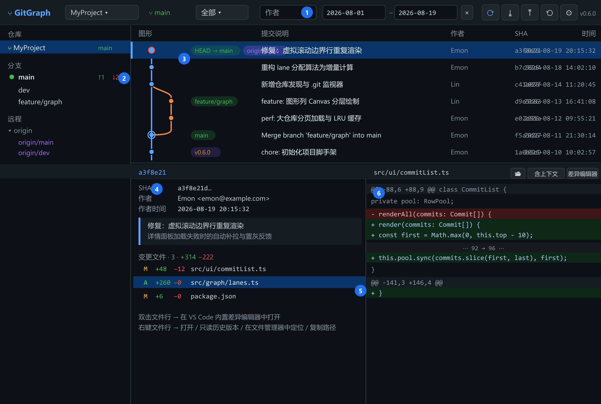
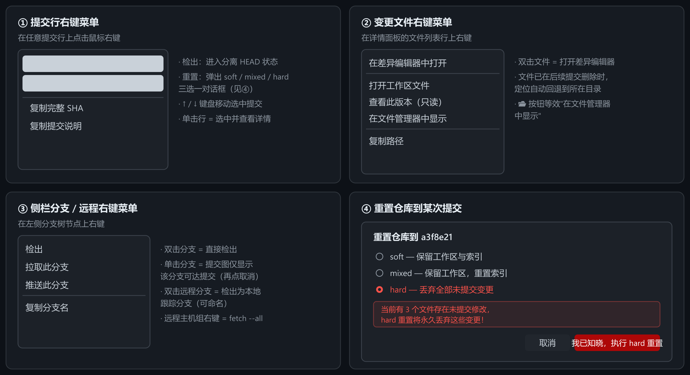
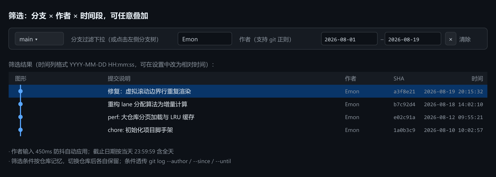

# GitBoard — Git 可视化提交图 / Git Commit Graph for VS Code

**简体中文** | [English](#english-documentation)

GitBoard 是一个 VS Code 桌面版插件，以 SourceTree 风格的图形化提交历史为核心，浏览与操作 Git 仓库：彩色拓扑提交图、提交详情与差异对比、以及 Fetch / Pull / Push / 重置 / 切换分支等日常 GUI 操作。针对大仓库做了分页加载、虚拟滚动与分层渲染优化。**v0.7.0 新增「工作副本」提交视图**：SourceTree 式勾选暂存与提交（单文件差异、提交/推送/修订上次提交），并接入 GitHub Copilot 一键生成提交信息（流式填充，自动遵循工程 `.copilot/` 指示文件）。

GitBoard is a VS Code extension (desktop) that visualizes and operates Git repositories with a SourceTree-style commit graph: colored topology, commit details & diffs, plus everyday GUI operations (Fetch / Pull / Push / Reset / Checkout). Built for large repos with paging, virtualized scrolling and layered rendering. **New in v0.7.0 — the "Working Copy" commit view**: SourceTree-style checkbox staging and committing (single-file diff, commit / commit & push / amend), plus one-click AI commit messages via GitHub Copilot (streamed inline, automatically following workspace `.copilot/` instruction files).



---

## 中文文档

### 功能特性

| 特性 | 说明 |
| --- | --- |
| 图形化提交历史 | 彩色拓扑图呈现分支、合并、交叉与多根仓库；HEAD / 本地分支 / 远程分支 / 标签徽标 |
| 提交详情 | 完整 SHA（一键复制）、作者/提交者、完整提交注释、变更文件列表（状态与 ± 行数） |
| 差异对比 | 面板内联 diff（紧凑模式只看增删行，`⋯` 折叠无差异段落）+ VS Code 内置差异编辑器（语法高亮） |
| 文件操作 | 打开工作区文件、查看任意历史版本（只读）、在系统文件管理器中定位（已删除文件自动回退父目录）、复制路径 |
| GUI Git 操作 | Fetch（--all --prune）、Pull（merge/rebase/ff-only）、Push（含设置上游）、重置到提交（soft/mixed/hard）、切换分支、检出远程分支、分离 HEAD |
| 工作副本提交（v0.7.0） | 已暂存/未暂存分组，勾选即暂存/取消；单文件 HEAD↔工作副本差异（无页签）；提交 / 提交并推送 / 修订上次提交 / 暂存全部并提交；最近 8 条信息复用；丢弃（双重确认）；草稿按仓库持久化 |
| AI 提交信息（v0.7.0） | GitHub Copilot 生成提交信息：流式填充、可停止/重新生成/选模型；基于已暂存差异 + 近 10 条提交学习风格与语言；自动遵循 `.copilot/`、`.github/copilot-instructions.md` 等工程指示文件；复用 VS Code 当前登录账号，扩展零凭证 |
| 筛选 | 分支/远程/标签过滤 + 作者 + 时间段（可叠加，条件按仓库记忆） |
| 大仓库性能 | 分页加载（500/页，自动上限可配）、DOM 虚拟滚动 + Canvas 只绘视口、.git 监视防抖自动刷新 |
| 界面 | 跟随 VS Code 明暗主题、列宽拖拽并持久化、中英双语、状态栏当前分支 |

### 安装

**方式〇：扩展市场（发布后可用）**

扩展面板（Ctrl+Shift+X）搜索 **GitBoard** 安装（ID：`EmonZhang3438.gitboard`），或命令行：

```bash
code --install-extension EmonZhang3438.gitboard
```

**方式一：命令行安装 vsix（推荐）**

```bash
code --install-extension gitboard-0.7.0.vsix
```

安装后执行 **Ctrl+Shift+P → “开发者：重新加载窗口”**（每次覆盖安装新版本后都需要）。

**方式二：VS Code 界面安装**

扩展面板（Ctrl+Shift+X）→ 右上角 `···` → **“从 VSIX 安装…”** → 选择 `gitboard-0.7.0.vsix` → 重新加载窗口。

**方式三：从源码构建**

```bash
git clone <本仓库> && cd 09_GitGraph
npm install
npm run package     # 产出 gitboard-x.y.z.vsix
```

### 快速上手

1. 打开任意包含 Git 仓库的文件夹/工作区；
2. 点击**左侧活动栏的 GitBoard 图标**（或 `Ctrl+Alt+G`，或命令面板执行 `GitBoard: 打开提交图`）——主界面直接打开；
3. 单击提交行查看详情，双击变更文件打开差异编辑器，右键探索各项操作；
4. 提交代码：点击工具栏 **「▣ 工作副本」**（或 `Ctrl+Alt+C`）→ 勾选要暂存的文件 → 撰写或点 ✨ 由 Copilot 生成提交信息 → `Ctrl+Enter` 提交。

### 功能使用详解

#### 1. 界面布局

对照上方总览图的编号：**①** 工具栏（Fetch/Pull/Push/刷新/设置/版本号 + 筛选控件）；**②** 左侧栏（仓库、本地分支含 `↑领先 ↓落后` 徽标、远程、标签）；**③** 提交图（彩色走线、节点、ref 徽标）；**④** 详情概要（SHA、作者、时间、完整注释）；**⑤** 变更文件列表；**⑥** 内联差异。详情面板高度可拖拽、可折叠，位置可在设置中改为右侧。工具栏最左端的分段控件可在「**⎔ 提交图 ⇄ ▣ 工作副本**」两个视图间一键切换（工作副本视图见下文第 7 节），两个视图的状态互相保留。

#### 2. 浏览提交图

- 图形列：短半径圆角走线，主干直线、换轨紧凑；普通节点为实心圆，**合并提交带外环**，**HEAD 节点带红色描边**；
- 徽标颜色：绿色=本地分支、紫色=远程分支、黄色=标签、`HEAD → main` 表示当前分支；
- 列表滚动到底部自动加载下一页（默认每页 500 条，自动加载上限 20000 条，超出后点“继续加载更多”）；
- ↑ / ↓ 键盘上下移动选中；仓库发生变更（提交/切换分支/fetch）自动防抖刷新。

#### 3. 查看提交详情与差异

- **单击提交行**：底部面板显示完整 SHA（点击复制）、作者/提交者与邮箱、作者时间/提交时间（`YYYY-MM-DD HH:mm:ss`，可在设置改为相对时间）、完整提交注释（标题+正文）；
- **单击变更文件**：右侧立即显示内联 diff。默认**紧凑模式**只显示增删行、以 `⋯ 行号 ⋯` 折叠无差异段落；点“含上下文”切换为带 3 行上下文的完整视图；
- **双击文件**（或点“差异编辑器”按钮）：打开 VS Code 内置差异编辑器，左侧为父提交版本、右侧为该提交版本，带语法高亮；
- 合并提交按第一父提交口径显示差异（与 SourceTree 默认一致）。

#### 4. Git 操作



- **Fetch**：工具栏 ⟳，默认 `--all --prune`（可配置）；也可在侧栏远程主机/远程分支上右键按单个远程获取；打开视图时可配置自动 fetch；
- **Pull / Push**：工具栏 ⤓ / ⤒，作用于当前分支；Push 无上游时弹窗引导创建；所有网络操作显示实时进度（百分比）并可取消；
- **重置到某次提交**：提交行右键 →“重置到此提交…”，选择 soft / mixed / hard；工作区有未提交修改且选择 hard 时，必须点击红色确认按钮（防误触）；
- **切换分支**：双击侧栏分支即检出；双击远程分支弹出命名框，创建本地跟踪分支；提交行右键可“检出此提交”（分离 HEAD）。

#### 5. 筛选



工具栏提供三组可叠加的筛选：**分支下拉**（或单击侧栏分支/远程/标签节点）、**作者输入框**（支持 git 正则语法，输入后自动应用）、**起止日期选择器**（截止日期含当天全天）。有筛选时显示 × 一键清除；筛选无结果时空态会明确提示。条件按仓库分别记忆。

#### 6. 个性化

- **列宽**：图形/提交说明/作者/SHA 四列表头右缘可拖拽调宽（悬停高亮），自动持久化，重装不丢；时间列自适应剩余空间；
- **主题**：全部颜色消费 VS Code 主题变量，明暗自动适配；
- **语言**：默认跟随 VS Code（中文/英文），可强制指定。

#### 7. 工作副本与提交（v0.7.0 新增）

SourceTree 式提交流程，全程不离开 GitBoard：

- **视图**：工具栏「▣ 工作副本」页签（带脏文件数徽标）或 `Ctrl+Alt+C` 进入；左右为文件列表与差异，底部为提交信息栏；
- **暂存**：左栏分「已暂存 / 未暂存」两组，**勾选即 `git add`、取消勾选即取消暂存**（乐观更新）；重命名显示 `旧名 → 新名`，未跟踪标 `U`；支持过滤、全部暂存/取消、右键批量操作；
- **看差异**：点击任一文件行，右栏显示该文件 **HEAD ↔ 工作副本的完整差异**（本次已暂存+未暂存合并，无页签）；`‹ ›` 在更改文件间逐个切换；未跟踪文件显示为全新增；
- **写提交信息**：单一多行输入框，首行即摘要（计数 50 提示）、空行后为正文；`🕘` 复用最近 8 条提交信息；草稿按仓库自动保存，切视图/重开不丢；
- **提交**：`Ctrl+Enter` 或「提交 ⏎」按钮；下拉可选 **提交并推送 / 修订上次提交**（自动载入上次信息并警示）/ **暂存全部并提交**；hooks 失败会展示完整输出；
- **AI 生成**：点 **✨** 由 GitHub Copilot 基于已暂存差异生成提交信息——流式填入输入框，可 `Esc` 停止、重新生成、切换模型；语言与风格自动学习近 10 条提交；若工程定义了 `.copilot/*.md`、`.github/copilot-instructions.md`、`.github/instructions/*.instructions.md` 指示文件将自动遵循；首次使用会请求确认（差异将发送至 Copilot 服务）；
- **丢弃**：右键文件 →「丢弃更改…」，红色双重确认后回到 HEAD（未跟踪文件直接删除）。

### 快捷键

| 按键 | 功能 |
| --- | --- |
| `Ctrl+Alt+G`（macOS `Cmd+Alt+G`） | 打开提交图 |
| `Ctrl+Alt+C`（macOS `Cmd+Alt+C`） | 打开工作副本（提交）视图并聚焦信息栏 |
| `Ctrl+Enter` | 提交（提交信息框内） |
| `Esc` | 停止 AI 生成 |
| `↑` / `↓` | 移动选中提交 |
| `Enter` | 打开文件所在差异（在详情面板中） |

### 常用设置（`Ctrl+,` 搜索 "gitboard"）

| 设置 | 默认 | 说明 |
| --- | --- | --- |
| `gitboard.gitPath` | 自动检测 | git 可执行文件路径 |
| `gitboard.commitPageSize` | 500 | 每页加载提交数（100–5000） |
| `gitboard.maxAutoLoad` | 20000 | 自动加载上限 |
| `gitboard.defaultPullStrategy` | merge | pull 策略：merge / rebase / ff-only |
| `gitboard.dateFormat` | datetime | 时间格式：YYYY-MM-DD HH:mm:ss / 相对时间 / ISO |
| `gitboard.rowHeight` | default | 行高：紧凑 20 / 标准 24 / 舒适 28 |
| `gitboard.graphStyle` | curved | 走线风格：短半径圆角 / 直角折线 |
| `gitboard.detailPanelPosition` | bottom | 详情面板位置：底部 / 右侧 |
| `gitboard.language` | auto | 界面语言 |
| `gitboard.fetchOnOpen` | true | 打开视图时自动 fetch |
| `gitboard.startView` | graph | 打开时的初始视图：提交图 / 工作副本 / 上次使用 |
| `gitboard.ai.enabled` | true | 启用 Copilot 生成提交信息（不可用时自动隐藏入口） |
| `gitboard.ai.modelFamily` | 默认模型 | 首选 Copilot 模型 family |
| `gitboard.ai.language` | auto | 生成语言（auto = 跟随近期提交） |
| `gitboard.ai.learnFromHistory` | true | 学习近 10 条提交的风格与语言 |
| `gitboard.ai.useWorkspaceInstructions` | true | 遵循工程指示文件（`.copilot/`、`.github/`） |
| `gitboard.commit.clearMessage` | true | 提交成功后清空信息框 |
| `gitboard.commit.pushAfter` | false | 「提交后推送」复选框默认值 |

### 从源码开发

```bash
npm install
npm run watch       # F5 调试（“运行 GitBoard 扩展”）
npm run typecheck   # 双工程类型检查
npm test            # 单元测试 + 真实 git 冒烟（GITBOARD_SMOKE=1 启用）
npm run build && npm run package
```

### 常见问题

- **安装新版本后行为没变化？** 务必执行“开发者：重新加载窗口”；可对照工具栏右侧版本号确认当前构建。
- **支持 vscode.dev / github.dev 吗？** 不支持，插件需要在本机执行 git 命令。
- **超大仓库卡吗？** 分页 + 虚拟滚动保证流畅；可运行 `git commit-graph write --reachable` 进一步加速翻页。
- **✨ AI 生成按钮没出现？** 需要 VS Code ≥ 1.99 且已登录 GitHub Copilot（与 Copilot Chat 同一账号）；未登录或不可用时按钮自动隐藏，其余提交功能不受影响。也可检查 `gitboard.ai.enabled` 是否开启。
- **AI 会发送什么内容？** 已暂存差异（暂存为空时为全部更改）与工程指示文件内容，经 GitHub Copilot 服务处理（使用你当前登录的账号与配额）；首次使用会弹窗确认，超限文件只发送统计不发送内容。

---

## English Documentation

**[简体中文](#中文文档)** | **English**

GitBoard brings a SourceTree-style commit graph to VS Code (desktop): browse history with a colored topology, inspect commits and diffs, and run everyday Git operations from the GUI.


### Features

| Feature | Description |
| --- | --- |
| Commit graph | Colored topology with branches, merges, criss-cross and multi-root repos; HEAD / branch / remote / tag chips |
| Commit details | Full SHA (one-click copy), author/committer, full message, changed files with status and ± line counts |
| Diffs | Inline diff (compact mode shows changed lines only, `⋯` folds unchanged runs) + the built-in diff editor with syntax highlighting |
| File actions | Open working file, open any revision read-only, reveal in the system file manager (falls back to the parent folder for deleted files), copy path |
| Git operations | Fetch (--all --prune), Pull (merge/rebase/ff-only), Push (with upstream setup), Reset to commit (soft/mixed/hard), checkout branches, checkout remote branch as local tracking, detached HEAD |
| Working-copy commits (v0.7.0) | Staged/Unstaged groups with checkbox staging; single-file HEAD↔worktree diff (no tabs); Commit / Commit & Push / Amend / Stage-all-and-commit; recent-message reuse; discard with double confirmation; per-repo message drafts |
| AI commit messages (v0.7.0) | One-click generation via GitHub Copilot: streamed inline, stop/regenerate/model picker; based on the staged diff + style learned from the last 10 commits; automatically follows `.copilot/` and `.github/` workspace instruction files; uses your signed-in VS Code account — zero credentials stored |
| Filtering | Branch/remote/tag filter + author + date range, stackable and remembered per repository |
| Large-repo performance | Paged loading, virtualized rows + viewport-only canvas rendering, debounced auto-refresh on `.git` changes |
| UI | Follows VS Code light/dark themes, drag-resizable persisted columns, English/中文, status-bar branch |

### Install

**Option 0 — Marketplace (once published)**

Search **GitBoard** in the Extensions view (Ctrl+Shift+X), ID: `EmonZhang3438.gitboard`, or:

```bash
code --install-extension EmonZhang3438.gitboard
```

**Option 1 — CLI (recommended)**

```bash
code --install-extension gitboard-0.7.0.vsix
```

Then run **Ctrl+Shift+P → “Developer: Reload Window”** (required after every upgrade).

**Option 2 — From the UI**

Extensions view (Ctrl+Shift+X) → `···` → **“Install from VSIX…”** → pick the file → reload.

**Option 3 — From source**

```bash
npm install && npm run package
```

### Quick Start

1. Open a folder/workspace containing Git repositories;
2. Click the **GitBoard icon in the Activity Bar** (or press `Ctrl+Alt+G`, or run `GitBoard: Open Commit Graph`);
3. Click a commit row for details, double-click a file to open the diff editor, right-click everywhere for more actions;
4. To commit: switch to the **“▣ Working Copy”** tab on the toolbar (or `Ctrl+Alt+C`) → check the files to stage → write the message or click ✨ to generate it with Copilot → `Ctrl+Enter` to commit.

### Using the Features

**Layout** — see the numbered badges in the overview: ① toolbar & filters, ② branch/remote/tag tree, ③ commit graph, ④ commit summary, ⑤ changed files, ⑥ inline diff. The detail panel is drag-resizable and collapsible. The segmented control on the far left of the toolbar switches between the **Graph** and **Working Copy** views (see below); state is preserved across switches.

**Browsing** — solid dots are commits, merged commits carry a ring, the HEAD node has a red outline. Chips: green = local branch, purple = remote, yellow = tag, `HEAD → main` = current branch. Scrolling near the bottom auto-loads the next page (500/page by default; auto-load caps at 20,000 with a manual “Load more” button). `↑`/`↓` move the selection.

**Details & diffs** — click a row to load the full SHA, author/committer, dates (`YYYY-MM-DD HH:mm:ss` by default) and the complete message. Click a file to preview its diff inline — compact mode highlights only added/removed lines and folds unchanged runs into `⋯` rows; switch to “With context” for full context. Double-click a file (or use the header button) to open VS Code’s built-in diff editor (parent revision ↔ commit). Merge commits are diffed against their first parent.


**Operations** — ① commit-row context menu (detached checkout, reset, copy SHA/subject); ② file context menu (open working file, read-only revision, reveal in file manager, copy path); ③ branch menu (checkout/pull/push/copy; double-click a branch to check it out, single-click to filter the graph; double-click a remote branch to create a local tracking branch); ④ the reset dialog — hard resets require an explicit red confirmation when uncommitted changes exist. Fetch/Pull/Push show live progress and can be cancelled.


**Filtering** — branch dropdown (or click a tree node), author box (git regex supported, auto-applies), and a date range (the end date includes the whole day). Filters stack, are remembered per repository, and map to `git log --ref / --author / --since / --until`.

**Personalization** — drag column borders in the header to resize (persisted across sessions); time column absorbs the remaining space; colors follow your theme; UI language follows VS Code.

**Working copy & commits (new in v0.7.0)** — a SourceTree-style flow without leaving GitBoard. Switch via the “▣ Working Copy” tab (dirty-file badge) or `Ctrl+Alt+C`. The left pane groups **Staged / Unstaged** files — **check a box to `git add`, uncheck to unstage** (optimistic updates); renames show `old → new`, untracked files are marked `U`. Clicking a file shows its **full HEAD↔worktree diff** on the right (staged + unstaged combined, no tabs), with `‹ ›` to walk through changed files. The bottom bar has a single multi-line message box (first line = subject, live 50-char counter), a 🕘 recent-messages picker, and the **Commit ⏎** button with a dropdown: Commit & Push / Amend last commit / Stage-all-and-commit; `Ctrl+Enter` commits, drafts are saved per repository. **✨ AI** generates the message from your staged diff via GitHub Copilot — streamed inline, stop with `Esc`, regenerate or switch models at will; language and style are learned from the last 10 commits, and workspace instruction files (`.copilot/*.md`, `.github/copilot-instructions.md`, `.github/instructions/*.md`) are followed automatically; a one-time confirmation explains what gets sent. Right-click → “Discard…” resets files to HEAD (untracked files are deleted) behind a red double confirmation.

### Keybindings & Settings

- `Ctrl+Alt+G` / `Cmd+Alt+G` — open the graph; `Ctrl+Alt+C` — open the Working Copy (commit) view; `Ctrl+Enter` — commit (inside the message box); `Esc` — stop AI generation; `↑`/`↓` — move selection.
- Search “gitboard” in Settings for page size, auto-load limit, pull strategy, date format, row height, graph style, detail panel position, language, auto-fetch on open, plus the v0.7.0 additions: `startView`, `ai.enabled` / `ai.modelFamily` / `ai.language` / `ai.learnFromHistory` / `ai.useWorkspaceInstructions`, `commit.clearMessage` / `commit.pushAfter`.

### FAQ

- **Nothing changed after upgrading?** Run “Developer: Reload Window”; the version label on the toolbar right edge tells you which build is live.
- **vscode.dev?** Not supported — the extension runs your local `git`.
- **Huge repos?** Paging + virtualization keep it smooth; `git commit-graph write --reachable` speeds up paging further.
- **No ✨ AI button?** AI commit messages need VS Code ≥ 1.99 and an active GitHub Copilot sign-in (the same account as Copilot Chat). The button hides itself when unavailable — everything else keeps working. Also check `gitboard.ai.enabled`.
- **What does AI send?** The staged diff (or all changes when nothing is staged) plus workspace instruction files, processed by the GitHub Copilot service under your signed-in account and quota; a one-time confirmation appears before the first use, and oversized files are reduced to summary stats only.

### Development

```bash
npm install
npm run watch        # then press F5 (“运行 GitBoard 扩展”)
npm run typecheck && npm test
npm run build && npm run package
```

---

## 许可证 / License

[MIT](./LICENSE) © 2026 Emon
